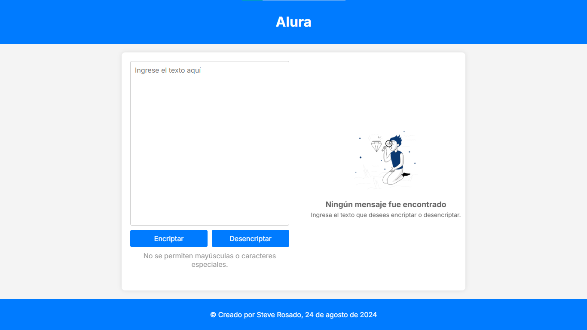

# Encriptador de Texto

Este proyecto es un encriptador y desencriptador de texto simple implementado con HTML, CSS y JavaScript. Su objetivo es transformar un texto introducido por el usuario en un formato encriptado basado en reglas específicas, y luego permitir la desencriptación del mismo.

## Características

- **Interfaz de Usuario:**
  - Dos áreas de texto: Una para ingresar el texto a encriptar y otra para mostrar el texto desencriptado.
  - Dos botones: Uno para encriptar y otro para desencriptar el texto.
  - Mensaje de advertencia que indica que solo se aceptan letras minúsculas y sin acentos.

- **Funcionalidad de Encriptación:**
  - Transforma vocales a cadenas de texto más largas basadas en un conjunto de reglas predeterminadas.

- **Funcionalidad de Desencriptación:**
  - Invierte la encriptación, devolviendo el texto a su forma original.

## Tecnologías Utilizadas

- **HTML:** Estructura de la página web.
- **CSS:** Estilos para la presentación y diseño de la página web, incluyendo estilos responsivos.
- **JavaScript:** Lógica para la encriptación y desencriptación de textos, así como manejo de eventos y actualización del contenido de la página.

## Estructura del Proyecto

- **HTML (index.html):** Contiene la estructura básica del proyecto, incluyendo dos áreas de texto (textarea), dos botones y un footer con el año actual.
- **CSS (style.css):** Define el estilo visual del proyecto, con fuentes, colores, y layout. Incluye reglas de estilo para pantallas pequeñas (max-width: 800px).
- **JavaScript (app.js):** Maneja la lógica para encriptar y desencriptar texto, utilizando reglas definidas en un objeto `llavesEncriptador`.

## Reglas de Encriptación

- `a` se convierte en `ai`
- `e` se convierte en `enter`
- `i` se convierte en `imes`
- `o` se convierte en `ober`
- `u` se convierte en `ufat`

Por ejemplo, el texto "hola" se encriptará como "hoberlai".

## Reglas de Desencriptación

- `ai` se convierte en `a`
- `enter` se convierte en `e`
- `imes` se convierte en `i`
- `ober` se convierte en `o`
- `ufat` se convierte en `u`

Por ejemplo, el texto "hoberlai" se desencriptará de nuevo a "hola".

## Instrucciones de Uso

1. **Encriptar un texto:**
    - Escribe el texto que deseas encriptar en el área de texto a la izquierda.
    - Haz clic en el botón "Encriptar".
    - El texto encriptado aparecerá en el área de texto a la derecha.

2. **Desencriptar un texto:**
    - Escribe o pega el texto encriptado en el área de texto a la derecha.
    - Haz clic en el botón "Desencriptar".
    - El texto desencriptado aparecerá en el área de texto a la izquierda.

3. **Limpiar áreas de texto:**
    - Después de encriptar o desencriptar, el área de texto de entrada se limpiará automáticamente.

## Personalización

Puedes modificar las reglas de encriptación cambiando los valores en el objeto `llavesEncriptador` en el archivo `app.js`. El diseño visual puede personalizarse editando el archivo `style.css`.
